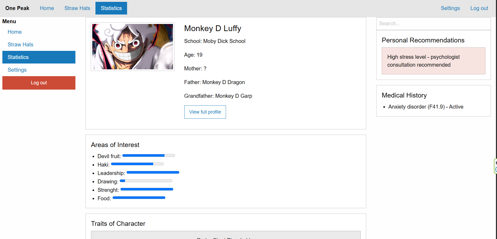

# One Piece Academy – Dagdoelen App

## Naam  
**One Piece Academy**

## Caption  
*Stel je dagdoelen in, volg je voortgang en ontdek jouw pad binnen de wereld van One Piece.*

---

## Screenshot  
Zo ziet de website eruit:

---

## Pagina’s  
- **Student modus (index.html)**  
- **Coach modus (docenten.html)**  
- **One Piece Characters (jaja.html)**  
- **One Peak website screenshot (screenshot.png)**  

---

## Student Modus  
Hier stel je je dagdoel in:  
- Naam invullen  
- Dagdoel beschrijven  
- Begin‑ en eindtijd kiezen  
- Dagplanning bekijken (start, pauzes, einde)

Daarnaast zie je:  
- Voorbeeldstudenten (Luffy & Zoro)  
- Facties uit One Piece: Strawhat Pirates, Revolutionary Army, World Government

---

## Coach Modus  
Coaches zien alle ingediende doelen en kunnen deze beoordelen:  
- Naam  
- Dagdoel  
- Begin‑ en eindtijd  
- ✔ Goedkeuren  
- ✖ Afkeuren  

---

## One Piece Characters  
Een overzicht van de Strawhat Pirates:  
Luffy, Zoro, Nami, Usopp, Sanji, Chopper, Robin, Franky, Brook, Jinbei  
en de schepen: Going Merry & Thousand Sunny.

---

## Toekomstige uitbreidingen  
- Backend (PHP + database)  
- Dagdoelen opslaan  
- Dynamisch coachdashboard  
- Login‑systeem  
- Studenten automatisch genereren  
- Animaties en betere styling  
- Filters en sortering  

---

## Pagina’s  
- Start / Student pagina  
- Coach pagina  
- One Piece Characters pagina  
- Website screenshot pagina
